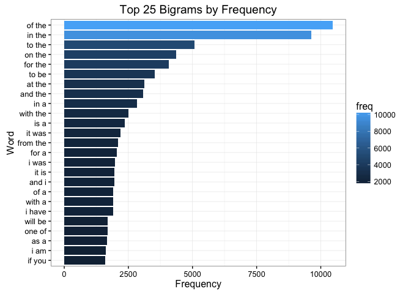
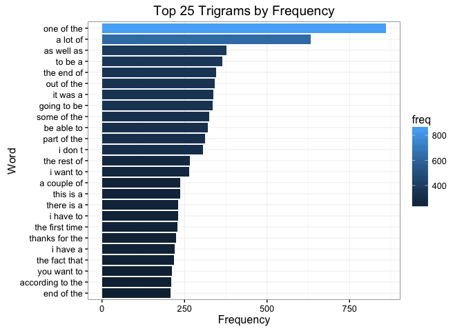
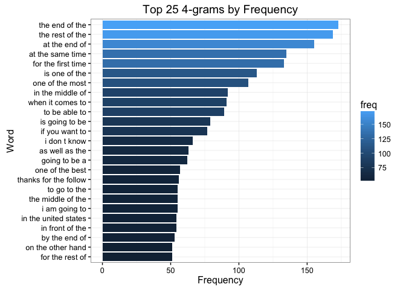
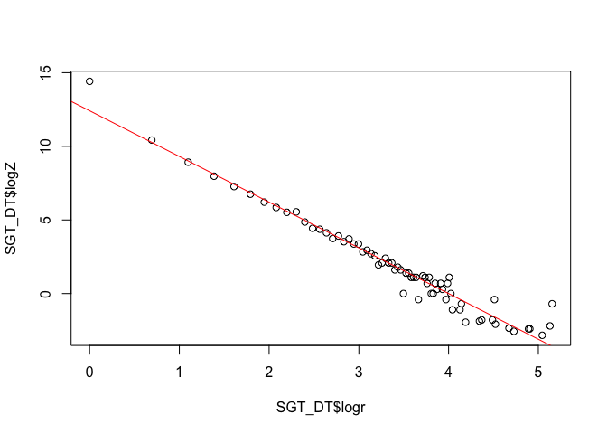
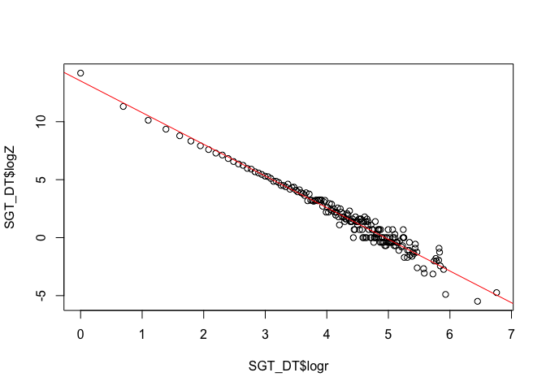
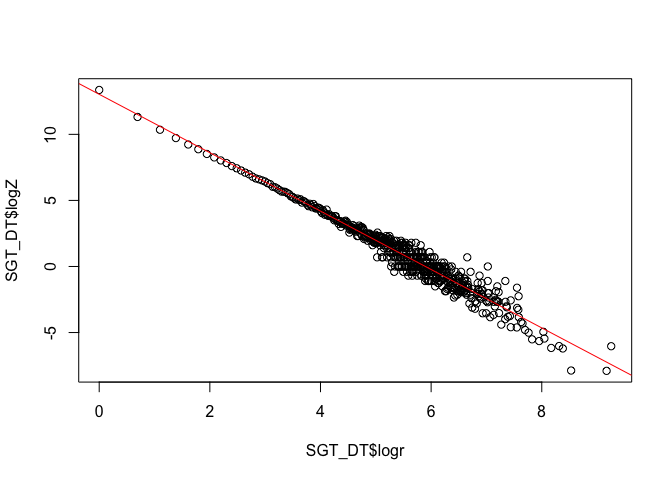

# Data Science Capstone: Final Report
Amber Beasock  
24 April 2016  

---------------------------------------------------------------------------------- 


### Table of Contents

+ [1 - Introduction](#id-1 - Introduction)
+ [2 - Obtaining & Preprocessing Data](#id-2 - Obtaining & Preprocessing Data)
    - [2.1 - Load Libraries Needed](#id-2.1 - Load Libraries Needed)
    - [2.2 - Basic Summary of Data](#id-2.2 - Basic Summary of Data)
    - [2.3 - Data Sample](#id-2.3 - Data Sample)
    - [2.4 - Construct the Corpus](#id-2.4 - Construct the Corpus)
    - [2.5 - N-gram Tokenization](#id-2.5 - N-gram Tokenization)  
    - [2.6 - Data Visualizations](#id-2.6 - Data Visualizations)  
    - [2.7 - Simple Good Turing Algorithm](#id-2.7 - Simple Good Turing Algorithm) 
+ [3 - Prediction Model](#id-3 - Prediction Model)
+ [4 - Shiny App](#id-4 - Shiny App)
+ [5 - Conclusion](#id-5 - Conclusion)

----------------------------------------------------------------------------------

<div id='id-1 - Introduction'/>
### 1 - Introduction
This is the final report for the Data Science Capstone course. The goal of this project is to perform exploratory data analysis of a large corpus of text documents to discover the structure in the data and how words are put together.
This training data supplied for getting started on the capstone project can be downloaded [here](https://d396qusza40orc.cloudfront.net/dsscapstone/dataset/Coursera-SwiftKey.zip) [1.41GB]. 

The data package contains text files from several different languages. For this project, only the English text files will be evaluated. There are three English text files: `en_US.blogs.txt`, `en_US.news.txt`, and `en_US.twitter.txt`. Since the text files are large, only random subsets of the files will be used for the analysis.

----------------------------------------------------------------------------------

<div id='id-2 - Obtaining & Preprocessing Data'/>
### 2 - Obtaining & Preprocessing Data

<div id='id-2.1 - Load Libraries Needed'/>
#### 2.1 - Load Libraries Needed

```r
library(stringi)
library(stringr)
library(tm)
library(slam)
library(RWeka)
library(reshape)
library(ggplot2)
```

<div id='id-2.2 - Basic Summary of Data'/>
#### 2.2 - Basic Summary of Data
The code below is used to calculate and summarize the size, the number of lines, and the number of words in each text file. 

```r
# Check the file sizes in MB
size_blog <- file.info("../final/en_US/en_US.blogs.txt")$size / 1024^2
size_news <- file.info("../final/en_US/en_US.news.txt")$size / 1024^2
size_twit <- file.info("../final/en_US/en_US.twitter.txt")$size / 1024^2

blogs   <- readLines("../final/en_US/en_US.blogs.txt", encoding="UTF-8")
news    <- readLines("../final/en_US/en_US.news.txt", encoding="UTF-8")
twitter <- readLines("../final/en_US/en_US.twitter.txt", encoding="UTF-8")

# Check the number of lines in each file
len_blog <- length(blogs)
len_news <- length(news)
len_twit <- length(twitter)

# Total words in each file
words_blog <- sum(stri_count_words(blogs))
words_news <- sum(stri_count_words(news))
word_twit <- sum(stri_count_words(twitter))

df <- data.frame (
  file_name = c("Blog", "News", "Twitter"),
  size_MB = c(size_blog, size_news, size_twit),
  number_lines = c(len_blog, len_news, len_twit),
  number_words = c(words_blog, words_news, word_twit)
  )
print(df)
```

```
##   file_name  size_MB number_lines number_words
## 1      Blog 200.4242       899288     37546246
## 2      News 196.2775      1010242     34762395
## 3   Twitter 159.3641      2360148     30093369
```
  
<div id='id-2.3 - Data Sample'/>
#### 2.3 - Data Sample
Given the large size of the text files, a random sample of 25,000 lines from each of the three files is used.

```r
set.seed(320)
sample_blogs <- blogs[sample(1:length(blogs),25000)]
sample_news <- news[sample(1:length(news),25000)]
sample_twitter <- twitter[sample(1:length(twitter),25000)]

sample_data <- c(sample_blogs, sample_news, sample_twitter)
```

<div id='id-2.4 - Construct the Corpus'/>
#### 2.4 - Construct the Corpus
The `tm` package is used to create and clean a corpus. Transformations to the data that are performed are:

- Convert special characters to space
- Convert to lowercase
- Remove punctuation
- Remove numbers
- Remove profanity using the Google bad words dataset [[link]](https://gist.github.com/jamiew/1112488)
- Strip whitespace


```r
# Remove white space
sample_data <- str_trim(gsub('[ ]+',' ',sample_data))

docs <- Corpus(VectorSource(sample_data))

# Change special characters to spaces
toSpace <- content_transformer(function(x, pattern) gsub(pattern, " ", x))
docs <- tm_map(docs, toSpace, "/|@|\\|")
docs <- tm_map(docs, content_transformer(function(x) iconv(x, to="ASCII", sub=" ")))

# Convert to lowercase
docs <- tm_map(docs, content_transformer(tolower))

# Remove punctuation
docs <- tm_map(docs, removePunctuation)

# Remove numbers
docs <- tm_map(docs, removeNumbers)

# Remove bad words
googlebadwords <- read.delim("../google_badwords.txt",sep = ":",header = FALSE)
googlebadwords <- googlebadwords[,1]
docs <- tm_map(docs, removeWords, googlebadwords)

# Eliminate white space
docs <- tm_map(docs, stripWhitespace)

# Save the Corpus
corpus_df <- data.frame(text=unlist(sapply(docs, `[`, "content")), stringsAsFactors=FALSE)
write.csv(corpus_df, file="../corpus_df.csv",row.names=FALSE)
corpus <- read.csv("../corpus_df.csv")
mycorpus <- Corpus(DataframeSource(corpus))
```

<div id='id-2.5 - N-gram Tokenization'/>
#### 2.5 - N-gram Tokenization
N-gram models are used to evaluate word frequenies. Using the `RWeka` package, 3 term-document matrics are used to create unigrams, bigrams, and trigrams.

```r
# Sets the default number of threads to use
options(mc.cores=1)

#Bigrams
BigramTokenizer <- function(x) NGramTokenizer(x, Weka_control(min = 2, max = 2))
bitdm <- TermDocumentMatrix(mycorpus, control = list(tokenize = BigramTokenizer))
bitdm <- rollup(bitdm, 2, na.rm=TRUE, FUN = sum)
bi_freq <- sort(rowSums(as.matrix(bitdm)),decreasing=TRUE)

value2_1 <- sapply(strsplit(names(bi_freq), ' '), function(a) a[1])
value2_2 <- sapply(strsplit(names(bi_freq), ' '), function(a) a[2])

gram2 <- data.frame(names(bi_freq),bi_freq,value2_1,value2_2,stringsAsFactors = F)
names(gram2) <- c('bigram','count','input','output')
melt2 <- melt(gram2, id=c('bigram','input','output'), measure=c('count'))
summed2 <- cast(melt2, input ~ variable, sum)
names(summed2)[names(summed2)=="count"] <- "sum"
gram2 <- gram2[order(gram2$count, decreasing=TRUE),]
gram2 <- merge(gram2, summed2, by="input")
gram2 <- transform(gram2, p = count/sum)
gram2 <- gram2[order(gram2$bigram, -gram2$p),]

#Trigrams
TrigramTokenizer <- function(x) NGramTokenizer(x, Weka_control(min = 3, max = 3))
tritdm <- TermDocumentMatrix(mycorpus, control = list(tokenize = TrigramTokenizer))
tritdm <- rollup(tritdm, 2, na.rm=TRUE, FUN = sum)
tri_freq <- sort(rowSums(as.matrix(tritdm)),decreasing=TRUE)

value3_1  <- sapply(strsplit(names(tri_freq), ' '),function(a) a[1])
value3_2  <- sapply(strsplit(names(tri_freq), ' '),function(a) a[2])
value3_3  <- sapply(strsplit(names(tri_freq), ' '),function(a) a[3])

gram3 <- data.frame(names(tri_freq),tri_freq,paste(value3_1,value3_2),value3_3,stringsAsFactors = F)
names(gram3) <- c('trigram','count','input','output')
melt3 <- melt(gram3, id=c('trigram','input','output'), measure=c('count'))
summed3 <- cast(melt3, input ~ variable, sum)
names(summed3)[names(summed3)=="count"] <- "sum"
gram3 <- gram3[order(gram3$count, decreasing=TRUE),]
gram3 <- merge(gram3, summed3, by="input")
gram3 <- transform(gram3, p = count/sum)
gram3 <- gram3[order(gram3$trigram, -gram3$p),]

# 4-grams
FourgramTokenizer <- function(x) NGramTokenizer(x, Weka_control(min = 4, max = 4))
fourtdm <- TermDocumentMatrix(mycorpus, control = list(tokenize = FourgramTokenizer))
fourtdm <- rollup(fourtdm, 2, na.rm=TRUE, FUN = sum)
four_freq <- sort(rowSums(as.matrix(fourtdm)),decreasing=TRUE)

value4_1  <- sapply(strsplit(names(four_freq), ' '),function(a) a[1])
value4_2  <- sapply(strsplit(names(four_freq), ' '),function(a) a[2])
value4_3  <- sapply(strsplit(names(four_freq), ' '),function(a) a[3])
value4_4  <- sapply(strsplit(names(four_freq), ' '),function(a) a[4])

gram4 <- data.frame(names(four_freq),four_freq,paste(value4_1,value4_2,value4_3),value4_4,stringsAsFactors = F)
names(gram4) <- c('fourgram','count','input','output')
melt4 <- melt(gram4, id=c('fourgram','input','output'), measure=c('count'))
summed4 <- cast(melt4, input ~ variable, sum)
names(summed4)[names(summed4)=="count"] <- "sum"
gram4 <- gram4[order(gram4$count, decreasing=TRUE),]
gram4 <- merge(gram4, summed4, by="input")
gram4 <- transform(gram4, p = count/sum)
gram4 <- gram4[order(gram4$fourgram, -gram4$p),]
```

<div id='id-2.6 - Data Visualizations'/>
#### 2.6 - Data Visualizations 
Graph the 25 most frequently occuring bigrams 

```r
bi_freq_df <- data.frame(word = names(bi_freq),freq=bi_freq)

g <- ggplot(head(bi_freq_df,25), aes(x=reorder(word, freq), y=freq, fill=freq))    +
    geom_bar(stat = "identity") +  
    theme_bw() +
    coord_flip() +
    xlab("Word") + ylab("Frequency") +
    labs(title = "Top 25 Bigrams by Frequency") 
print(g)
```

<!-- -->

Graph the 25 most frequently occuring trigrams 

```r
tri_freq_df <- data.frame(word = names(tri_freq),freq=tri_freq)

g <- ggplot(head(tri_freq_df,25), aes(x=reorder(word, freq), y=freq, fill=freq))    +
    geom_bar(stat = "identity") +  
    theme_bw() +
    coord_flip() +
    xlab("Word") + ylab("Frequency") +
    labs(title = "Top 25 Trigrams by Frequency") 
print(g)
```

<!-- -->

Graph the 25 most frequently occuring 4-grams 

```r
four_freq_df <- data.frame(word = names(four_freq),freq=four_freq)

g <- ggplot(head(four_freq_df,25), aes(x=reorder(word, freq), y=freq, fill=freq))    +
    geom_bar(stat = "identity") +  
    theme_bw() +
    coord_flip() +
    xlab("Word") + ylab("Frequency") +
    labs(title = "Top 25 4-grams by Frequency") 
print(g)
```

<!-- -->

<div id='id-2.7 - Simple Good Turing Algorithm'/>
#### 2.7 - Simple Good Turing Algorithm 
##### Developed by Gale And Simpson ([more info](http://www.grsampson.net/AGtf1.html))
##### Good Turing Smoothing

```r
SimpleGT <- function(table_N){  
  # table_U is a table of frequency of frequencies
  # The frequencies are stored as names of the list in the table structure
  # the values are the frequency of frequencies.
  # In Good Turing Smoothing, we are concerned with the frequency of frequencies
  # So, to extract the number of times that words of frequency n occur in the training set, we need to do:
  # table(freq_B)[[as.character(pairCount)]]
  # In a tables with a number of holes or non-contiguous sequence of frequency of words,
  # we can compute N(c+1) as the mean of all frequencies that occur more than Nc times
  # to do this, create a vector that is in the numerical form of the names of the table
  
  # create a data table
  # r is the frequencies of various n-grams
  #n is the frequency of frequencies
  SGT_DT <- data.frame(r=as.numeric(names(table_N)),n=as.vector(table_N),Z=vector("numeric",length(table_N)), 
                       logr=vector("numeric",length(table_N)),
                       logZ=vector("numeric",length(table_N)),
                       r_star=vector("numeric",length(table_N)),
                       p=vector("numeric",length(table_N)))
  #p=vector("numeric",length(table_N)),key="r")
  
  str(SGT_DT)
  
  num_r <- nrow(SGT_DT)
  for (j in 1:num_r) {
    if(j==1) {r_i<-0} else {r_i <- SGT_DT$r[j-1]}
    if(j==num_r){r_k<-SGT_DT$r[j]} else {r_k <- SGT_DT$r[j+1]}
    SGT_DT$Z[j] <- 2*SGT_DT$n[j] / (r_k-r_i)
    #print(paste(r_i,j,r_k))
  }
  SGT_DT$logr <- log(SGT_DT$r)
  SGT_DT$logZ <- log(SGT_DT$Z)
  linearFit <- lm(SGT_DT$logZ ~ SGT_DT$logr)
  print(linearFit$coefficients)
  c0 <- linearFit$coefficients[1]
  c1 <- linearFit$coefficients[2]
  
  plot(SGT_DT$logr, SGT_DT$logZ)
  abline(linearFit,col="red")
  
  use_y = FALSE
  for (j in 1:(num_r-1)) {
    r_plus_1 <- SGT_DT$r[j] + 1
    
    s_r_plus_1 <- exp(c0 + (c1 * SGT_DT$logr[j+1]))
    s_r <- exp(c0 + (c1 * SGT_DT$logr[j]))
    y<-r_plus_1 * s_r_plus_1/s_r
    
    if(use_y) {
      SGT_DT$r_star[j] <- y
    } else { 
      n_r_plus_1 <- SGT_DT$n[SGT_DT$r == r_plus_1]
      n_r <- SGT_DT$n[j]
      x<-(r_plus_1) * n_r_plus_1/n_r
      
      if (abs(x-y) > 1.96 * sqrt(((r_plus_1)^2) * (n_r_plus_1/((n_r)^2))*(1+(n_r_plus_1/n_r)))) {
        SGT_DT$r_star[j] <- x
      }else {
        SGT_DT$r_star[j] <- y
        use_y = TRUE
      }
    }
    if(j==(num_r-1)) {
      SGT_DT$r_star[j+1] <- y
    }
    
  }
  N <- sum(SGT_DT$n * SGT_DT$r)
  Nhat <- sum(SGT_DT$n * SGT_DT$r_star)
  Po <- SGT_DT$n[1] / N
  SGT_DT$p <- (1-Po) * SGT_DT$r_star/Nhat
  
  return(SGT_DT)  
}
```


```r
#SGT tables for 4grams 
four_SGT_DT <- SimpleGT(table(four_freq))
```

<!-- -->

```r
#SGT tables for trigrams 
tri_SGT_DT <- SimpleGT(table(tri_freq))
```

<!-- -->

```r
#SGT tables for bigrams 
bi_SGT_DT <- SimpleGT(table(bi_freq))
```

<!-- -->

```r
save(bi_SGT_DT,tri_SGT_DT,four_SGT_DT,file = 'SGT.RData')

# use the counts in the Simple GT table to extract the probability and replace the probability in 4-gram table with it by matching counts
gram4$p <- sapply(gram4$count,FUN=function(x) four_SGT_DT$p[four_SGT_DT$r==x]) 
# use the counts in the Simple GT table to extract the probability and replace the probability in trigram table with it by matching counts
gram3$p <- sapply(gram3$count,FUN=function(x) tri_SGT_DT$p[tri_SGT_DT$r==x])
# use the counts in the Simple GT table to extract the probability and replace the probability in bigram table with it by matching counts
gram2$p <- sapply(gram2$count,FUN=function(x) bi_SGT_DT$p[bi_SGT_DT$r==x])

# Save the bigrams, trigrams, and 4-grams to one file
save(gram2,gram3,gram4,file = 'ngrams.RData')
```

Example of n-gram table after SGT (4-gram table)

```
##                 input           fourgram count output sum            p
## 1476957    the end of     the end of the   173    the 343 8.108411e-05
## 1521231   the rest of    the rest of the   169    the 266 8.108411e-05
## 539464  for the first for the first time   133   time 189 6.561599e-05
## 200388     at the end      at the end of   155     of 182 6.117122e-05
## 1104652    one of the    one of the most   107   most 861 4.676093e-05
```

----------------------------------------------------------------------------------

<div id='id-3 - Prediction Model'/>
### 3 - Prediction Model

The prediction algorithm utilizes the _Simple Good Turing Algorithm_ developed by Gale And Simpson ([more info](http://www.grsampson.net/AGtf1.html)) and _Stupid Backoff_.

Each n-gram table includes the ngram, input, output, and probability.
For example, a record from the 4-gram table:

```
##              input       fourgram count output sum            p
## 1476957 the end of the end of the   173    the 343 8.108411e-05
```

In the 4-gram table example, the `input` is the first 3 words (3-gram) of the 4-gram,  the `output` is the last word (unigram), `count` shows the number of times the output is occuring with the input, `sum` shows how often the input is occuring and `probability` is the count/sum.

First, the last 3 words (or 2 if that's all that's input) are taken from the entered text. The 4-gram table if subset by matching 3-grams (input). Similarly, the 3-gram table is subset by matching 2-grams and the 2-gram table is subset by matching unigrams. 

If there are matching 4-grams and 3-grams, the 3-gram probabilities are multipled by 0.4 (due to backing off 1 level) and then the matching 4-grams and 3-grams are combined and reordered by highest probability. The top three words are presented as next word predictions. 

If the 4-grams or 3-grams have less than three matches, then the 2-grams are used to fill in the remaining needed matches to make three predictions. 

The 2-grams were very inaccurate in the prediction testing, even when using backoff techniques, which is why only 4-grams and 3-grams are considered if available.

Finally, if there are no matches in the 4-grams, 3-grams, or 2-grams then the message **"No prediction found"** is outputed.


```r
# Libraries needed for the prediction model
library(tm)
library(stringr)
library(dplyr)

predict <- function(input) {
  # grab the last 3 words & clean input 
  input <- str_trim(input)
  input <- str_extract(input,'[A-Za-z]*[ ]*[A-Za-z]*[ ]*[A-Za-z]+$')
  input <- tolower(input)
  input_split <- strsplit(input,' ')

  # recompose last 3 words for 4-gram
  input3 <- input
  # get the subset of the 4gram data table with a matching trigram start
  sgram4 <- as.data.frame(NULL)
  if (is.na(input_split[[1]][3])==FALSE){
    sgram4 <- gram4[gram4$input == input3,]      
  }
  
  # recompose last 2 words for tri-gram
  input2 <- str_extract(input,'[A-Za-z]+[ ]+[A-Za-z]+$')
  # get the subset of the trigram data table with a matching bigram start
  sgram3<- gram3[gram3$input == input2,]
  
  # recompose last 1 word for bi-gram
  input1   <- str_extract(input,'[A-Za-z]+$')
  # get the subset of the bigram data table with a matching unigram start    
  sgram2<- gram2[gram2$input == input1,]
  
  topsgram4 <- NULL
  topsgram3 <- NULL
  topsgram2 <- NULL
  topmatches <- NULL
  predictions <- NULL
  finalpredict <- NULL

  #check if trigram was found in the 4gram table
  if(nrow(sgram4) > 0) {
    # order by highest probability
    sgram4 <- sgram4[with(sgram4,order(-p)),]
    colnames(sgram4)[2] <- "gram"
    topsgram4 <- sgram4
    topsgram4 <- topsgram4[is.na(topsgram4$input)==FALSE,]
  } 
  #check if bigram was found in the trigram table
  if(nrow(sgram3) > 0) {
    # order by highest probability
    sgram3 <- sgram3[with(sgram3,order(-p)),]
    colnames(sgram3)[2] <- "gram"
    topsgram3 <- sgram3   
    topsgram3 <- topsgram3[is.na(topsgram3$input)==FALSE,]      
  }  
  #check if unigram was found in the bigram table
  if(nrow(sgram2) > 0) {
    # order by highest probability
    sgram2 <- sgram2[with(sgram2,order(-p)),]
    colnames(sgram2)[2] <- "gram"
    topsgram2 <- sgram2
    topsgram2 <- topsgram2[is.na(topsgram2$input)==FALSE,]    
  } 

  if((length(topsgram4)>0) | (length(topsgram3)>0)) {
    #Stupid Back-off to compare fourgrams & trigrams and order by highest probability
    topsgram3$p <- topsgram3$p * 0.4
    topmatches <- rbind(topsgram4,topsgram3)
    topmatches <- topmatches[with(topmatches,order(-p)),]
    #Remove duplicate matches in case the same output word is high on the probability list due to being in 4grams & trigrams
    topmatches <- topmatches[!duplicated(topmatches[,4]),]
    
    #get the top 3 words
    predictList <- topmatches[1:3,'output']
    predictions <- predictList[is.na(predictList)==FALSE]  
  }
  
  #If 3 matching 4grams or trigrams then print the prediction words
  if(length(predictions)==3){
    return(predictions)
  }
  
  # If less than 3 matching 4grams or trigrams or no matches then use bigrams with highest probability to get the remaining prediction words
  if((length(predictions)<3) & (length(topsgram2)>0)) {
    predictList2 <- topsgram2[1:10, 'output'] #Get the top 10 in case there are any of the same words already in the 4 or 3-gram strings
    predictions2 <- predictList2[is.na(predictList2)==FALSE]   
    
    newpredictions <- c(predictions, predictions2) #Combine matching 4, 3, & 2-grams in a string
    newpredictions <- paste(unique(newpredictions)) #Remove any duplicated words
    finalpredict <- newpredictions[1:3] #Take the top 3 words
    return(finalpredict)
  }
  if((length(predictions)==0) & (length(finalpredict)==0)){
    print(paste("No prediction found"))
  }  
} 
```

----------------------------------------------------------------------------------

<div id='id-4 - Shiny App'/>
### 4 - Shiny App

In the final part of this project, a Shiny app was developed to deploy the predictive model. The app allows a user to input a phrase (multiple words) and click "submit". The predictive model is deployed and it attempts to match the last 3, 2, and 1 words of the user's input to the n-gram tables. The three words the algorithm calculates as mostly to occur next in the phrase are outputed. If the prediction model is unable to make a prediction then the message "No prediction found" will appear in the Prediction output box.

Source code for ui.R and server.R files are available on my GitHub in the project_app folder of the Capstone repository (https://github.com/abeasock/Capstone-Coursera).

----------------------------------------------------------------------------------

<div id='id-5 - Conclusion'/>
### 5 - Conclusion

The accurarcy of the prediction model is low due to restraints in processing power and data volume. The app needed to be able to quickly deploy and analysis a user's input. To be able to keep the processing times low only a small percentage of the provided corpus could be used. Another contraint I ran into was the memory limit on my laptop, which is another reason I had to drastically reduce the size of data processed. 
